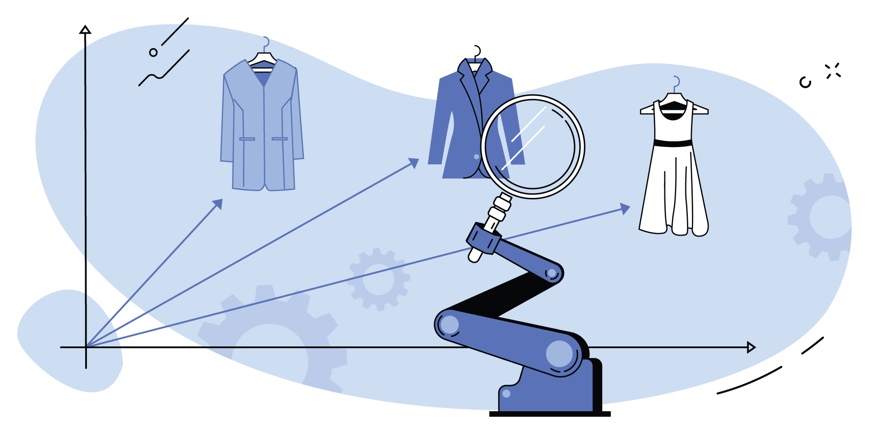

# Recommender Systems

## Behold, the power of Recommender Systems:

Systems allows you to **make recommendation based on pairs of User & Action (Action Rating)**.During the last few decades, with the rise of Youtube, Amazon, Netflix and many other such web services, recommender systems have taken more and more place in our lives. From e-commerce (suggest to buyers articles that could interest them) to online advertisement (suggest to users the right contents, matching their preferences), recommender systems are today unavoidable in our daily online journeys.

In a very general way, recommender systems are **algorithms aimed at suggesting relevant items to users** (items being movies to watch, text to read, products to buy or anything else depending on industries) ([source](https://towardsdatascience.com/introduction-to-recommender-systems-6c66cf15ada)).

In case of E-commerce, Item recommendation is a huge part of modern e-commerce helping you find products you might be interested in. Content-based matching and collaborative filtering are among well-recognized and widely used methods to generate such recommendations.

## Beloved Features

Recommender system is ready for making magic in E-commerce recommendations.

1. Data example stores at Google Cloud Platform, organized in buckets with Google Cloud Storage.
2. Three simple models in use: popularity based, content-based, embeddings neural network.
3. Ratings of action are designed and proved.
4. Metrics of quality are designed and compared.
5. Simple Web service via Anvil is available while Google Colab is running.

<!-- START doctoc generated TOC please keep comment here to allow auto update -->
<!-- DON'T EDIT THIS SECTION, INSTEAD RE-RUN doctoc TO UPDATE -->
## Table of Contents

- [About Dataset](#about-dataset)
- [Popularity Based Model](#popularity-based-model)
- [Content Based Filtering Model](#content-based-filtering-model)
- [Embeddings Neural Network Model](#embeddings-neural-network-model)
- [Quality Metrics](#quality-metrics)
- [GUI](#gui)

<!-- END doctoc generated TOC please keep comment here to allow auto update -->
<!-- generated with [DocToc](https://github.com/thlorenz/doctoc) -->

## Quick Start
### About Dataset

Common Concept is all the actions made by user on Web site are collicting via Web services (f.e. Google Analytics, Yandex Metric, etc.) and can be used for advanced analytics:

1. **WARNING!** Датасет не относится к публичным, поэтому любое его распространение запрещено. По этой же причине полный доступ к исходным данным не открываем. В ходе работы будут представлены только его фрагменты для понимания сущностей, с которыми работаем.
2. Датасет относится к сфере **электронной коммерции (E-commerce)**. Обоснования актуальности выбор этих данных не требует, поскольку такие рекомендательные системы хорошо монетизируются.
3. Датасет состоит на **95% из качественных показателей**.
4. Датасет **нормализован**.
5. Датасет собран из трёх потоков данных: **кэшированные данные о географии пользователя и его устройства**, данные о **факте совершенной покупки и продукте**, данные CJM (**customer journey map**) о просмотренных пользователем продуктах.
6. Источник данных - условно-бесплатный сервис веб-аналитики Google Analytics 360. Хранение денормализованных данных - **Google Cloud Platform ( GCP )**. Выгрузка данных - **Google Cloud Storage** в формате csv.

#### Storage
Представим источник с данными. На картинке ниже - уже агрегированный в Google Storage в "buckets"-датасет в виде 100 .csv файлов (количество файлов = количеству потоков при загрузке с GCP):

#### Take a look

Схема данных с сущностями и их типами представлена ниже:

### Popularity Based Model

A common (and usually hard-to-beat) baseline approach is the Popularity model. This model is not actually personalized - it simply recommends to a user the most popular items that the user has not previously consumed. As the popularity accounts for the "wisdom of the crowds", it usually provides good recommendations, generally interesting for most people.

Ps. The main objective of a recommender system is to leverage the long-tail items to the users with very specific interests, which goes far beyond this simple technique.

### Content Based Filtering Model

Content-based filtering approaches depends only on the user previous choices, making this method robust to avoid the cold-start problem. For textual items, it is simple to use the raw text to build item profiles and user profiles.

Here we are using a very popular technique in information retrieval (search engines) named TF-IDF. This technique converts unstructured text into a vector structure, where each word is represented by a position in the vector, and the value measures how relevant a given word is for the corpus. As all items will be represented in the same Vector Space Model, it is to compute similarity between corpuses for the users.

### Embeddings Neural Network Model

When we want to compare 2 items we simply compare their respective vectors computing some similarity metric such as dot product or cosine similarity.

The choice of the metric is determined by the training method in place, we’ll cover that shortly. Unlike word vectors, item embeddings are not simply assigned and learned directly but inferred given the items’ content. That allows the recommender system to be applied to any new item, thus solving the “cold start” problem.
The model that embeds an item into a vector space is called an [encoder](https://tech.olx.com/item2vec-neural-item-embeddings-to-enhance-recommendations-1fd948a6f293).

*Source: https://gist.github.com/bsivanantham/15714bfdde68b70fa2b1a5e1fda82fe2

### Quality Metrics

For quality evaluation were used two types of metrics: **Recal@5 & Recall@10** and  **Conversion rate**.

*Recall* quantifies the number of positive class predictions made out of all positive examples in the dataset.
A conversion occurs when a visitor to your website completes a desired goal, such as filling out a form or making a purchase. The percentage of total visitors that convert is called your *Conversion rate*.

### GUI

Единственная причина, по которой выбран Anvil - удобство работы с Google Colab.

Публичный адрес: https://reco-system.anvil.app/

Адрес для разработки: https://anvil.works/

Интерфейс учитывает как пользователей, которые совершали покупки, так и новых пользователей. Для новых пользователей - используем модель на основе популярных товаров, для остальных же - предлагаем выбор из систем :)

**Вот так выглядит шведский стол:**

Выберем идентификатор клиента, который у нас уже был. Интерфейс покажет нам, что клиент просматривал / купил, а также то, что ему рекомендуется к покупке. Из минусов popularity based: в рекомендациях может встретиться товар, который пользователь уже покупал.

Сменим модель для предсказания и сравним результаты. Судя по всему, рекомендации очень приближены к тому, что искал посетитель. Было бы интересно добавить в модель также характеристики товаров, чтобы рекомендовать еще более близкие продукты.

Эта модель, как мы видим, делает рекомендации чуть шире, чем товары в запросах пользователя. Прививаем лояльность и интерес к бренду! Вендор-оринетированная система :)

